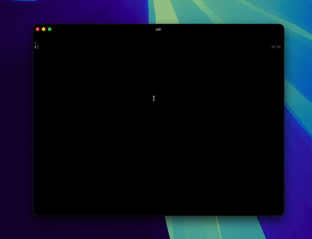
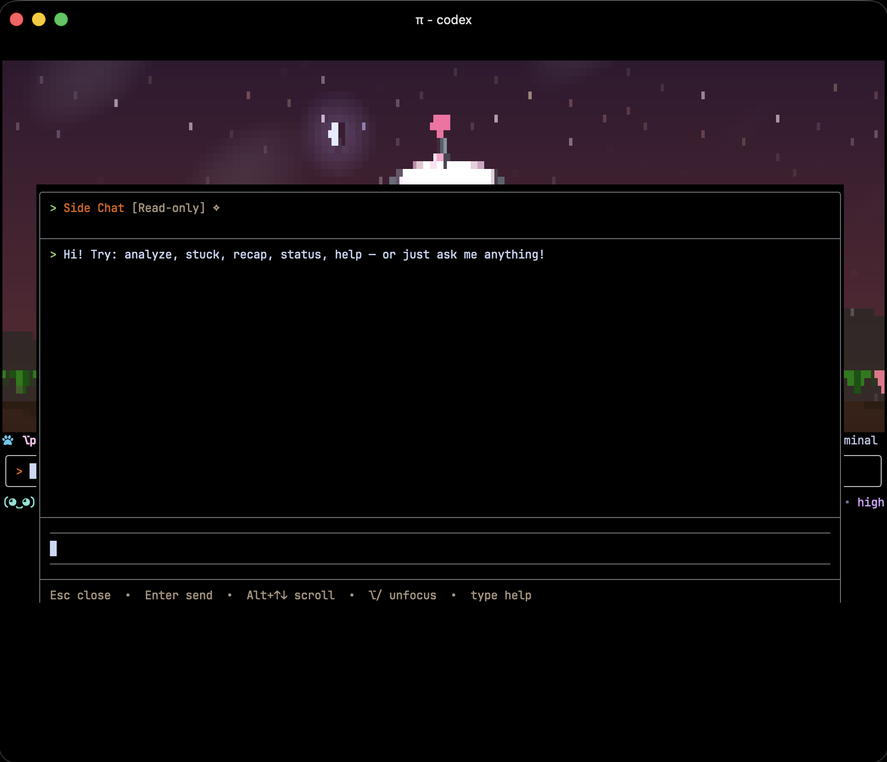
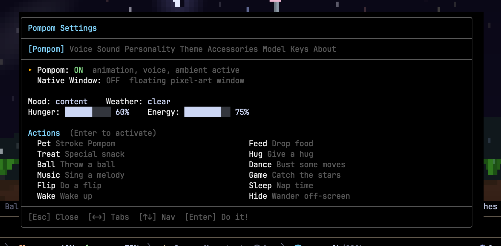

<p align="center">
  <b>English</b> | <a href="README.zh-CN.md">简体中文</a>
</p>

<p align="center">
  <b>Pi-Pompom</b> — a terminal pet for Pi CLI with voice, ambient weather,
  side chat, and agent-aware commentary.
</p>

<h1 align="center">pi-pompom</h1>
<p align="center"><strong>A 3D raymarched virtual pet with voice, ambient sounds, AI side chat, weather physics, and agent intelligence for Pi CLI.</strong></p>
<p align="center">
  <!-- BADGES:START -->
  <a href="https://www.npmjs.com/package/@codexstar/pi-pompom"></a>
  <a href="https://www.npmjs.com/package/@codexstar/pi-pompom"></a>
  <a href="https://opensource.org/licenses/MIT"></a>
  
  
  <!-- BADGES:END -->
</p>
<p align="center">
  <a href="#install">Install</a> ·
  <a href="#why-pompom">Why Pompom</a> ·
  <a href="#side-chat">Side Chat</a> ·
  <a href="#pi-listen--voice-input">Pi Listen</a> ·
  <a href="#agent-intelligence">Agent Intelligence</a> ·
  <a href="#voice-setup">Voice Setup</a> ·
  <a href="#commands">Commands</a> ·
  <a href="#keyboard-shortcuts">Shortcuts</a> ·
  <a href="#demo-mode">Demo</a> ·
  <a href="#features">Features</a> ·
  <a href="#settings-panel">Settings</a>
</p>

---

<p align="center">
  
</p>

---

Pompom is an interactive coding companion for [Pi CLI](https://github.com/mariozechner/pi-coding-agent). She lives in your terminal while you code, watches your agent work, and lets you talk to her about what's happening in your session without interrupting anything.

## Install

```bash
pi install @codexstar/pi-pompom
```

For the best experience, use a GPU-accelerated terminal like **Ghostty** or **Kitty**.

## Why Pompom

Pompom is not just a cute face. She is a **parallel AI assistant** that runs alongside your main coding agent.

- **Side Chat** (⌥/ or Alt+/) opens a floating AI panel. Ask her what the agent is doing, what went wrong, or get a full session recap. She watches every tool call and catches errors in real time.
- **Voice Input** with Pi Listen. Hold Space to talk directly to Pompom when her chat is focused.
- **Agent Dashboard** shows active tools, success rates, mood, and timing.
- **Stuck Detection** alerts you when your agent is looping on errors or stalled.
- **Session Analysis** gives you deep AI-powered insights and recommendations.

While all of that works in the background, she is also playful. She asks you to pet her, give her treats, throw a ball, dance together, and sing songs. She reacts to real weather, wears accessories, plays ambient sounds, and has a full mood system.

## Side Chat

Press `⌥/` (macOS) or `Alt+/` (Windows/Linux) or run `/pompom:chat` to open a floating AI chat panel alongside the main agent.

<p align="center">
  
</p>

- Pompom has her own AI instance running in parallel. She does not interrupt your main agent.
- Read-only tools only. Safe inspection mode, no accidental file edits.
- `peek_main` tool lets Pompom see what the agent is working on (with redacted tool output).
- Type `help` in the chat for built-in shortcuts: `analyze`, `stuck`, `recap`, `status`.
- Per-session conversations. Each new session starts fresh.
- Anchored at the center of the viewport, 60% max height.
- Press Esc to close, `⌥/` to toggle focus.

## Pi Listen / Voice Input

Pompom integrates with Pi's built-in voice input system. When Pompom's side chat is focused, holding Space activates `pi listen` and your speech is transcribed directly into the chat.

**How it works:**
1. Open side chat with `⌥/` (macOS) or `Alt+/`
2. Hold Space to start talking
3. Release Space and your speech gets transcribed into the Pompom chat
4. Pompom responds as a separate AI, with full context of what the main agent is doing

**What happens during voice input:**
- Pompom's mouth animates in sync with your audio level
- All TTS playback pauses automatically so your mic stays clean
- All sound effects are silenced
- Ambient weather sounds duck to a lower volume
- Everything resumes when you stop recording

No extra setup needed. If `pi listen` works in your Pi CLI, it works with Pompom's chat.

## Agent Intelligence

Pompom watches your coding agent and reacts in real time.

### AI Analysis Commands

| Command | What it does |
|---------|-------------|
| `/pompom:ask <question>` | Ask anything about the current session |
| `/pompom:recap` | Get a concise session summary |
| `/pompom:analyze` | Deep AI-powered analysis with recommendations |
| `/pompom:agents` | Real-time dashboard: active tools, success rate, mood, timing |
| `/pompom:stuck` | Check if agent is stuck in error loop |

### 7 Mood States
idle, curious, focused, busy, concerned, celebrating, sleepy

Mood is determined by tool call patterns, error rates, and activity timing. Weather reflects agent state. Storms on errors, snow on celebrations.

### Stuck Detection
Monitors consecutive error streaks, stalled progress (>5 min), high error rate (>50%), and repetitive tool calls. Pompom alerts with a speech bubble when confidence is high.

### Commentary System
10 event buckets with probability-based speech: agent start/end, tool calls, tool errors, messages. Commentary gap: 30s minimum between lines, 60s for same bucket.

## Voice Setup

Pompom supports 3 TTS engines. ElevenLabs gives the best experience with expressive audio tags.

### Quick Setup

```
/pompom:voice setup
```

This walks you through picking an engine, selecting a voice, and testing it.

### Engines

| Engine | Type | Voices | What makes it special |
|--------|------|--------|----------------------|
| **ElevenLabs** | Cloud (best quality) | 19 voices | Expressive audio tags: `[laughs]`, `[sighs]`, `[excited]`, `[whispers]`, `[crying]` |
| **Deepgram** | Cloud | 5 Aura-2 voices | Natural prosody from punctuation |
| **Kokoro** | Local (free, no API key) | 8 voices | Runs entirely on your machine, no network needed |

Audio tags are engine-aware. ElevenLabs keeps `[laughs]`, Kokoro and Deepgram get them stripped automatically.

### Voice Commands

| Command | What it does |
|---------|-------------|
| `/pompom:voice on\|off` | Enable/disable TTS |
| `/pompom:voice setup` | Interactive configuration |
| `/pompom:voice test` | Play a test phrase |
| `/pompom:voice kokoro\|deepgram\|elevenlabs` | Switch engine |
| `/pompom:voice voices` | List available voices |
| `/pompom:voice set <id>` | Set voice by ID |
| `/pompom:voice volume <0-100>` | Adjust volume |
| `/pompom:voice quiet\|normal\|chatty\|professional\|mentor\|zen` | Set personality |

### 6 Personalities

| Mode | Behavior |
|------|----------|
| **Quiet** | User actions + errors only |
| **Normal** | Moderate, casual (default) |
| **Chatty** | Frequent commentary |
| **Professional** | Errors, milestones, direct actions |
| **Mentor** | Guides on errors and completions |
| **Zen** | Near-silent, speaks only when addressed |

## Commands

### Pet Actions

| Command | What it does |
|---------|-------------|
| `/pompom` | Toggle companion on/off |
| `/pompom help` | Show all commands and shortcuts |
| `/pompom status` | Check mood, hunger, energy, theme |
| `/pompom pet` | Pet Pompom |
| `/pompom feed` | Drop food |
| `/pompom treat` | Special treat (extra hunger boost) |
| `/pompom hug` | Give a hug (restores energy) |
| `/pompom ball` | Throw a ball |
| `/pompom dance` | Dance with sparkle particles |
| `/pompom music` | Sing a song |
| `/pompom game` | Catch the stars! (20s mini-game) |
| `/pompom theme` | Cycle color theme |
| `/pompom sleep` | Nap on a pillow |
| `/pompom wake` | Wake up |
| `/pompom flip` | Do a backflip |
| `/pompom hide` | Wander offscreen |
| `/pompom toggle` | Hide/show animation (voice + tracking stay active) |
| `/pompom give <item>` | Give an accessory (umbrella, scarf, sunglasses, hat) |
| `/pompom inventory` | See Pompom's bag |

### Audio & Ambient

| Command | What it does |
|---------|-------------|
| `/pompom:ambient` | Ambient sound status |
| `/pompom:ambient on\|off` | Enable/disable weather ambient sounds |
| `/pompom:ambient volume <0-100>` | Adjust ambient volume |
| `/pompom:ambient pregenerate` | Generate all 5 weather sounds now |
| `/pompom:ambient reset` | Delete generated sounds and regenerate on next weather change |
| `/pompom:ambient folder` | Show custom audio folder path |

### Utilities

| Command | What it does |
|---------|-------------|
| `/pompom:chat` | Open side chat (parallel AI) |
| `/pompom:terminals` | Show all running Pompom instances |
| `/pompom:window` | Toggle native floating window (requires glimpseui) |
| `/pompom demo` | Autonomous ~135s narrated showcase |
| `/pompom-settings` | Interactive settings panel (9 tabs) |

## Keyboard Shortcuts

| macOS | Windows/Linux | Action |
|-------|--------------|--------|
| `⌥/` | `Alt+/` | **Side Chat** (most important!) |
| `⌥p` | `Alt+p` | Pet |
| `⌥n` | `Alt+n` | Feed |
| `⌥t` | `Alt+t` | Treat |
| `⌥u` | `Alt+u` | Hug |
| `⌥r` | `Alt+r` | Ball |
| `⌥x` | `Alt+x` | Dance |
| `⌥g` | `Alt+g` | Game |
| `⌥m` | `Alt+m` | Music |
| `⌥c` | `Alt+c` | Theme |
| `⌥s` | `Alt+s` | Sleep |
| `⌥a` | `Alt+a` | Wake |
| `⌥z` | `Alt+z` | Flip |
| `⌥o` | `Alt+o` | Hide |
| `⌥v` | `Alt+v` | Toggle view |

> **Note:** Alt+f, Alt+b, Alt+d, Alt+h, Alt+w are reserved by Pi's built-in editor. Pompom uses alternatives that don't conflict.

Four input methods supported: Ghostty keybinds, ESC prefix, macOS Unicode, Kitty keyboard protocol.

## Demo Mode

Run an autonomous narrated showcase of every feature (~135 seconds):

```
/pompom demo
```

Pompom narrates each feature as it happens: interactions, weather transitions, accessories, games, sleep/wake, color themes. Run `/pompom demo` again to stop early. Great for recording videos.

## Features

### 3D Rendering
- Raymarched body with real-time lighting, shadows, and floor reflections
- Hybrid renderer: Unicode quadrant blocks at edges (2x detail), half-blocks in smooth areas
- 4 color themes: Cloud, Cotton Candy, Mint Drop, Sunset Gold
- Natural animations: blinking, breathing, ear wiggling, tail wagging
- Widget renders at ~7 FPS via 150ms interval

### Weather & Physics
- Smooth sky color transitions (dawn to dusk)
- Sun disk with halo, crescent moon with glow, twinkling stars
- Rolling hills, swaying grass with flowers, drifting cloud wisps
- 5 weather types: clear, cloudy, rain, storm, snow
- Rain splash particles with ripple effects
- Snow accumulation as sparkle particles at ground level
- Wind system: storms push ears, antenna, body, and tail
- Ball physics with air resistance and spin transfer
- Firefly that glows brighter at night
- Weather-aware reactions every 2-5 minutes

### Ambient Weather Sounds
Background audio that matches the current weather with 23 layered sound effects.

- Custom audio: drop files in `~/.pi/pompom/ambient/custom/`
- Falls back to ElevenLabs Sound Effects API (cached locally)
- Auto-ducks during voice playback and sleep
- Linux ALSA support with WAV format generation

| Category | Effects |
|----------|---------|
| **Weather** | thunder, bird chirp, bee buzz, wind gust, rain drip, cricket chirp |
| **Actions** | pet purr, eat crunch, ball bounce, hug squeeze, sleep snore, wake yawn, dance sparkle, flip whoosh |
| **Events** | star chime, game start/end, hide tiptoe, peek surprise, firefly twinkle, color switch, weather transition, accessory equip, footstep |
| **Agent** | agent tick (subtle tick during tool execution) |
| **Needs** | hunger rumble, tired yawn |
| **Session** | session chime, session goodbye, milestone chime |

### Emotional Reactions
Pompom expresses emotions based on her needs:

- **Hungry** (<30%): asks for food with sad expressions
- **Starving** (<15%): dramatic hunger pleas
- **Tired** (<15%): sleepy whispers and yawns
- **Happy** (>80%): laughing and singing
- **Playful** (>60%): asks to play, dance, throw balls

19 spontaneous activity requests. She asks you to play, sing, dance, hug, and feed her during positive emotional states.

### Weather Accessories
- `/pompom give umbrella` for rain/storm
- `/pompom give scarf` for snow
- `/pompom give sunglasses` for clear weather
- `/pompom give hat` as a cute collectible
- Accessories persist across sessions

### Mini-Game: Star Catcher
- `/pompom game` starts a 20-second challenge
- Golden stars fall from the sky with sparkle effects
- Score announced with game-end jingle

### Multi-Terminal Awareness
- Primary instance election via heartbeat files (oldest terminal wins)
- Only the primary terminal plays ambient audio, weather SFX, and greetings
- `/pompom demo` narration plays in the terminal that starts it
- User-triggered SFX play on the active terminal
- `/pompom:terminals` shows all running instances

## Settings Panel

Run `/pompom-settings` to open the interactive 9-tab settings panel. No commands to memorize. Everything is right there.

<p align="center">
  
</p>

| Tab | What you can do |
|-----|----------------|
| **Pompom** | Pet, feed, play with 12 action buttons and mood/hunger/energy bars |
| **Voice** | Pick engine, select voice, adjust volume, toggle on/off, test |
| **Sound** | Toggle weather sounds, adjust volume, pregenerate ambient + SFX |
| **Personality** | Choose from 6 speech modes |
| **Theme** | Pick from 4 color palettes |
| **Accessories** | Give items with descriptions |
| **Model** | Select AI model for chat/ask/analyze |
| **Keys** | Full keyboard reference card |
| **About** | Dashboard with mood, hunger, energy, weather, voice, ambient, agent stats |

Navigate with arrow keys, Enter to select, Esc to close.

## Footer

Pompom adds a compact, information-rich status bar at the bottom of your Pi terminal.

<p align="center">
  
</p>

- Pompom's mood face + name (always visible)
- Hunger/energy bars with color-coded thresholds
- Weather icon + agent activity indicator
- Session timer, context usage bar, working directory, cost tracker
- Voice and ambient audio indicators
- Model name (intelligently shortened)
- All Nerd Font icons, Catppuccin Mocha colors, Powerline separators
- Adapts content based on terminal width: ultra-narrow shows just the face, ultra-wide shows everything

## Theme

Pompom ships with a **Catppuccin Mocha warm** theme (`themes/pompom.json`) that auto-activates on install:

- Warm pink accent with rosewater text
- Cozy message bubbles, gentle green/red tool result glows
- Thinking level borders that progress from cold/dark to warm/pink
- 51 color tokens fully compliant with Pi's theme schema

## Contributing

See [CONTRIBUTING.md](CONTRIBUTING.md) for development setup and guidelines.

## Security

See [SECURITY.md](SECURITY.md) for reporting vulnerabilities.

## License

MIT. See [LICENSE](LICENSE).

---

<p align="center">
  <strong>Made by <a href="https://abhishektiwari.co">Abhishek Tiwari</a></strong>
</p>
<p align="center">
  <a href="https://abhishektiwari.co">Website</a> ·
  <a href="https://x.com/baanditeagle">𝕏 Twitter</a> ·
  <a href="https://github.com/codexstar69/pi-pompom">GitHub</a> ·
  <a href="https://www.npmjs.com/package/@codexstar/pi-pompom">npm</a> ·
  <a href="https://github.com/codexstar69/pi-pompom/issues">Report a Bug</a> ·
  <a href="https://github.com/mariozechner/pi-coding-agent">Pi CLI</a>
</p>
